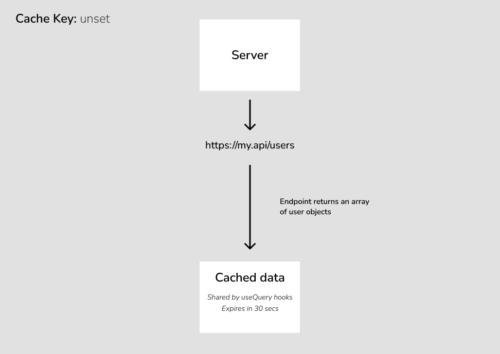
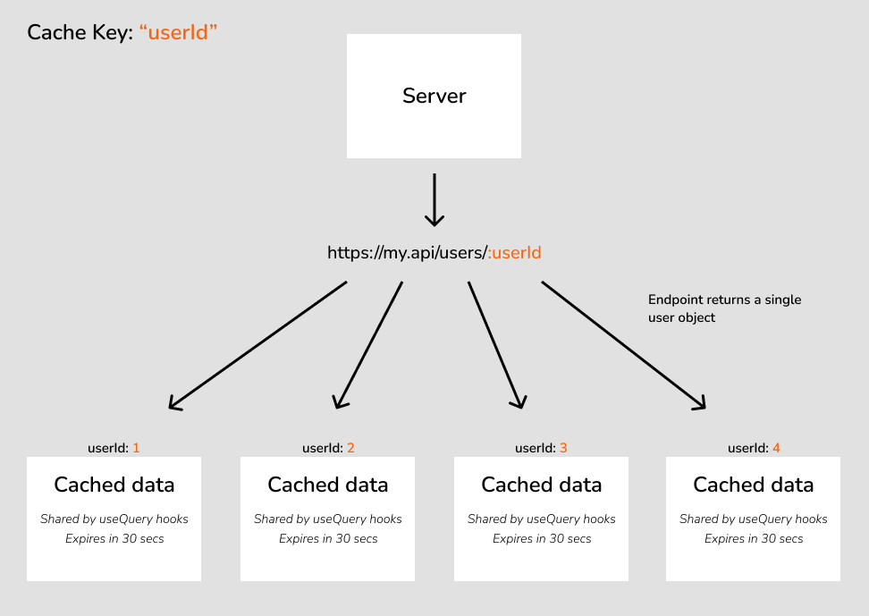

## Caching

The API Hooks [useQuery](hooks.md#usequery-get) hook has a customizable caching system that stores data as application-wide state. I find it helps to think of it in three parts:

#### 1. [Structure](#cache-keys---structuring-the-state)
Using the `cacheKey` property to ensure that there is a "single source of truth" for all dynamic data across the application, designed to match the structure of the API.

#### 2. [Validity](#refetch-queries---keeping-the-state-valid)
Using "refetch queries" to ensure that the user is seeing the latest data when you _know_ that it's changed, and using the timed caching options to keep data as fresh as necessary when you don't.

#### 3. [Optimization](#cache-config---optimizing-the-state)
Using the timed caching options to ensure that called to the server are only made when necessary.

### How does the caching work by default?

By default, API Hooks creates a "cache bucket" for each API endpoint, instances of the [useQuery](hooks.md#usequery-get) hook will then share the data in this bucket.

- Simultaneous requests for content from the same cache bucket are prevented, a single request to the server will fire and all [useQuery](hooks.md#usequery-get) instances will receive the response.
- The contents of a cache bucket, by default, will expire after **30 seconds**. After this time, the next request for the data from a [useQuery](hooks.md#usequery-get) instance will trigger a request to the server.

---

### Cache Keys - Structuring the State

#### When do I use a cache key?

For endpoints that don't receive parameters, the default "one endpoint to one cache bucket" relationship is all that's required. Take, for example, an endpoint that returns an array of user objects:



In the above example, the endpoint returns a consistent set of data that all [useQuery](hooks.md#usequery-get) instances can share, so no cache key is required.

However, for an endpoint that returns a different data set based on one or more parameters, the above example wouldn't be appropriate. Say, for example, we have an endpoint that returns a single user object based on a `userId` parameter. The "one endpoint to one cache bucket" relationship would mean that User 2's data would overwrite User 1's data within the global state, which would likely cause bugs in the UI when a component requests User 1 and receives the cached data for User 2.

This is where the `cacheKey` property comes into play. The correct solution for the above example is to set the `cacheKey` on our `/users/:userId` endpoint to the "userId" parameter. This means that multiple cache buckets will be created for a single endpoint, one for each different "userId" argument sent to the endpoint, like so:



This ensures that there will be no crossed wires when individual users are requested from the API.

#### How do I use a cache key?

Cache keys can be set as an [endpoint level setting](config.md#endpoint-level-settings) or a [hook level setting](config.md#hook-level-settings). Most of the time, its strongly advised to set up cache keys as an [endpoint level setting](config.md#endpoint-level-settings). This ensures that every time the [useQuery](hooks.md#usequery-get) is used, the cache key will be used automatically, it won't need to be added to every use of the query.

Wherever possibly, cache keys should be **a parameter name on the endpoint**, ideally the parameter that denotes "uniqueness" (often a database primary key.) Here's an example of a cache key added to the endpoint map to ensure it's set as an [endpoint level setting](config.md#endpoint-level-settings):
```TypeScript
export const endpointMapFactory: ApiHooks.HookConfigLibraryFactory<typeof apiClient> = (emptyMap) => {
  const endpointMap = { ...emptyMap }

  // the "get user" query returns a single instance of a data type, the cache key should be the primary key.
  endpointMap.user.getUser.query = {
    cacheKey: "userId",
  }

  return endpointMap
}
```

If required, cache keys can also be created from more than one parameter by using a factory function instead of supplying a parameter name. Like this:
```TypeScript
{
  cacheKey: params => `${params.groupId}-${params.userId}`;
}
```

---
### Refetch Queries - Keeping the State Valid

Because the results of [useQuery](hooks.md#usequery) are cached, it's often necessary to make sure cached data doesn't hang around once we _know_ it's been changed, like after a [useMutation](hooks.md#usemutation) for example. API Hooks has a dedicated solution for managing this called `refetchQueries`.

Here are some examples:

#### Endpoint level refetch - "Whenever I create/update a user, I want to make sure my user cache is up to date"

```TypeScript
import { ApiHooks } from "@rocketmakers/api-hooks"
import { apiClient } from "path/to/my/apiclient"
import { endpointIds } from "*Endpoint ID library location*"

// this factory function can be in a different file for readability
const myEndpointConfig: ApiHooks.HookConfigLibraryFactory<typeof apiClient> = (emptyConfig) => {
  const endpointSettings = { ...emptyConfig }

  endpointSettings.exampleQueries.getUser.query = {
    cacheKey: "userId",
  }

  endpointSettings.exampleMutations.updateUser.mutation = {
    refetchQueries: [
      endpointIds.exampleQueries.getUser({ cacheKeyFromMutationParam: "userId" }),
      endpointIds.exampleQueries.getUserList()
    ],
  }

    endpointSettings.exampleMutations.addUser.mutation = {
    refetchQueries: [
      endpointIds.exampleQueries.getUserList()
    ],
  }

  return endpointSettings
}

const apiHooks = ApiHooks.create(apiClient, {
  // pass your factory to the hookConfigFactory property
  hookConfigFactory: myEndpointConfig
})
```

Let's unpack what's happening here:

1. Whenever `updateUser` successfully runs from a [useMutation](hooks.md#usemutation) hook, all cache associated with the `getUserList` query will be invalidated, and so will all cache stored by `getUser` with a `cacheKey` that matches the `id` parameter sent to the `updateUser` mutation. To explain this further, if user `24` is updated for example, then all cache associated with user `24` will be invalidated, but cache stored by `getUser` relating to other user IDs will remain unaffected.
2. Whenever `addUser` successfully runs from a [useMutation](hooks.md#usemutation) hook, all cache associated with the `getUserList` will be invalidated.

NOTE:

- What does it mean when we say cache is "invalidated"? If there is a component rendered with a [useQuery](hooks.md#usequery) referencing the invalidated cache, then a new request for the data will fire immediately once the associated mutation is successful. If there is _not_ a component rendered with a [useQuery](hooks.md#usequery) referencing the invalidated cache, then any stored cache will simply be marked as invalid so that a new request will be fired in the event that a [useQuery](hooks.md#usequery) is mounted that references it.
- The config in the above example is defined at "endpoint level", meaning that these behaviors will apply to all associated hooks throughout the application. This is the recommended approach for `cacheKey` and `refetchQuery` config, because it means we don't need to remember to add these settings in every component which references this data. If need be though, all of this config can also be passed at "hook level."
- As well as `cacheKeyFromMutationParam`, a refetch query can also be defined with a `cacheKeyValue` property containing a hard value for the `cacheKey` to invalidate, this is more commonly used at "hook level" rather than endpoint level.
- If your `cacheKeyFromMutationParam` is inside an object being passed to the mutation, rather than a top level parameter, a function can also be passed to retrieve it, just like a normal `cacheKey`, for example:

```TypeScript
endpointSettings.exampleMutations.updateUser.mutation = {
  refetchQueries: [
    endpointIds.exampleQueries.getUser({ cacheKeyFromMutationParam: data => data.user.id }),
    endpointIds.exampleQueries.getUserList()
  ],
}
```

#### Defining refetch queries by factory function

To allow for more flexibility, the array of refetch queries can be returned from a factory function, allowing the list of requests to be dependent on the settings sent to the mutation.

In this example, the `id` property of our `updateUser` mutation is optional, and we only want to refetch the `getUser` query state **if** an `id` was passed to the mutation:

```TypeScript
endpointMap.user.updateUser.mutation = {
  refetchQueries: (settings) => {
    if (settings.parameters?.userId) {
      return [endpointIdentifiers.user.getUser({ cacheKeyValue: settings.parameters.userId })]
    }
    return []
  },
}
```

#### Refetch query context

Depending on the design of the API, it's sometimes the case that a query cache key needs more information than the contents of the mutation hook settings can provide. In these unusual cases, we can supply context from the hook that the refetch query can use to form a cache key.

In this example, the `getUser` endpoint requires a `categoryId` as well as the user's `id` in order to build the cache key for the query that needs to be re-fetched. The `categoryId` is not sent to the mutation, so we'll need to read it from context:
```TypeScript
endpointMap.user.updateUser.mutation = {
  refetchQueries: (settings) => {
    if (settings.parameters?.userId && settings.refetchQueryContext?.categoryId) {
      return [endpointIdentifiers.user.getUser({ cacheKeyValue: `${settings.parameters.userId}-${settings.refetchQueryContext.categoryId}` })]
    }
    return []
  },
}
```
In order for this to work, **all** components using this mutation will need to supply the necessary context, or the re-fetch will not execute. In this example, the `categoryId` is passed to the component as a prop, but it could come from anywhere:
```TypeScript
export const UserEdit: React.FC<{ categoryId: string }> = ({ categoryId }) => {

  const [updateUser, { isFetching: updating }] = apiHooks.user.updateUser.useMutation({
    refetchQueryContext: { categoryId }
  })
```

#### Advanced refetch query management

By default, an on-screen query that has been asked to perform a refetch will do so using the last parameters that were sent to it. If, however, you want to intercept that functionality, you can send some query params yourself.

This is particularly useful with paged queries, maybe the last request was for page `3` for example, and you want to ensure that the refetch request is for page `1`. For example:

```TypeScript
endpointSettings.exampleMutations.updateUser.mutation = {
  refetchQueries: [
    endpointIds.exampleQueries.getUser({ cacheKeyFromMutationParam: data => data.user.userId }),
    endpointIds.exampleQueries.getUserList({
      paramOverride: { page: 1 },
      paramOverrideMode: 'merge'
    })
  ],
}
```
The `paramOverrideMode` can be `merge` or `replace` and will dictate whether the `paramOverride` params merge with the last params used, or replace them entirely, when performing the refetch.

Refetch queries can also be compiled dynamically based on the settings passed to the mutation, do this by passing a function instead of an array, the function will receive the settings as a parameter. For example:

```TypeScript
endpointMap.user.updateUser.mutation = {
  refetchQueries: (settings) => {
    const queries = [endpointIdentifiers.user.getUserList()]
    if (settings.parameters?.id) {
      queries.push(endpointIdentifiers.user.getUser({ cacheKeyValue: settings.parameters?.id }))
    }
    return [endpointIdentifiers.user.getUserList()]
  },
}
```
This example will perform an extra refetch if an optional param is passed.

---

### Cache Config - Optimizing the State

As explained above, cache will be in place of a request to the server for **30 seconds** by default before becoming "stale". Stale data is re-requested from the server when requested by a [useQuery](hooks.md#usequery) hook. This timestamp is specific to each "cache bucket" (see the [structure](#cache-keys---structuring-the-state) section for an explanation of cache buckets.).

30 seconds on caching is not always appropriate. Maybe we're dealing with a "notifications" endpoint, for which the data changes frequently? Or maybe we're dealing with a "settings" endpoint, for which the data rarely changes at all?

Cache can be configured at [hook level setting](config.md#hook-level-settings) or [endpoint level setting](config.md#endpoint-level-settings) depending on whether the requirement is specific an endpoint as a whole, or a specific usage of it. The below example shows [endpoint level settings](config.md#endpoint-level-settings)

#### Always get the latest data

Should we want live data to always be requested when a [useQuery](hooks.md#usequery) hook mounts, we can achieve this by setting:
```TypeScript
export const endpointMapFactory: ApiHooks.HookConfigLibraryFactory<typeof apiClient> = (emptyMap) => {
  const endpointMap = { ...emptyMap }

  // Notifications are changing all the time, make sure we get the latest.
  endpointMap.user.getNotifications.query = {
    caching: {
      staleIfOlderThan: 'always'
    }
  }

  return endpointMap
}
```
Cache being `staleIfOlderThan: always` essentially translates to "always stale", meaning that cached data will never be used and a request to the server will always be preferred.

NOTE: This setting does **not** mean that simultaneous requests wil be fired for the same cache bucket on a single mount, one request will still be made and the data shared by appropriate [useQuery](hooks.md#usequery) hooks.

#### Always use the cache

Should we want live data to always be requested once and then cached forever (until the application is restarted or page refreshed), we can achieve this by setting:
```TypeScript
// App settings almost never changes, don't keep requesting it from the server.
endpointMap.user.getAppSettings.query = {
  caching: {
    staleIfOlderThan: "never"
  }
}
```
Cache being `staleIfOlderThan: never` essentially translates to "never stale", meaning that cached data will always be preferred over a request to the server.

#### Something in-between...

For a more nuanced approach to optimized caching, the `staleIfOlderThan` setting can also receive a number of milliseconds. After this time has elapsed, the cached data will become stale, the default is `30000`:
```TypeScript
// Notifications are changing fairly frequently, keep for 10 seconds.
endpointMap.user.getNotifications.query = {
  caching: {
    staleIfOlderThan: 10000
  }
}

// App settings change rarely, but can change, keep for 5 minutes.
endpointMap.user.getAppSettings.query = {
  caching: {
    staleIfOlderThan: 300000
  }
}
```

HINT: There are some helpful time functions in the `ApiHooksCaching` library, the above app settings config could have been written like this:
```TypeScript
staleIfOlderThan: ApiHooksCaching.Minutes.five()
```

---

### Caching Quirks - Auto invoke held for cache key parameter

It's often the case that a [useQuery](hooks.md#usequery) might need to `autoInvoke` in some cases and not others. As an example, say you're righting a user create/edit form, in "edit" mode, you'll need to query the existing user to edit, but in "create" mode, there's no query to run.

In this case, you might think you'd need a pattern like this:

```TypeScript
/* THE HARD WAY OF DOING IT */
import { apiHooks } from "*create method location*"

const MyComponent: React.FC<{ userId?: string }> = (props) => {

  const [{ data, isFetching }, getUserFetch] = apiHooks.users.getUser.useQuery({
    autoInvoke: false,
    cacheKey: 'userId'
  });

  React.useEffect(() => {
    if(props.userId) {
      getUserFetch({userId: props.userId})
    }
  }, [props.userId])

}
```

This will work perfectly well, but it's a lot of faff. API Hooks can will help you here:

**If the parameter being used as the `cacheKey` is null or undefined, `autoInvoke` will _not_ run on component load, but the query will run as soon as the parameter _becomes_ defined.**

So with that in mind, the above could just as easily be written like this:

```TypeScript
/* THE EASY WAY OF DOING IT */
import { apiHooks } from "*create method location*"

const MyComponent: React.FC<{ userId?: string }> = (props) => {

  // because "userId" is the cache key, the request will be "held" automatically if our prop isn't there.
  const [{ data, isFetching }] = apiHooks.users.getUser.useQuery({
    cacheKey: 'userId',
    parameters: { userId: props.userId }
  });
}
```

NOTE:
- If you really need to turn this functionality off, you can do this at any level via a query setting called `holdInvokeForCacheKeyParam`. (set it to `false`.)
- Unfortunately, this functionality can only work if a parameter key is specified as the cache key. If, on the other hand, your cache key is generated from a function, you'll need to hold the invoke manually as specified in the first example. Or alternatively, return `undefined` from your cache key generation function when an essential parameter isn't supplied.

[Back to Index](../README.md)